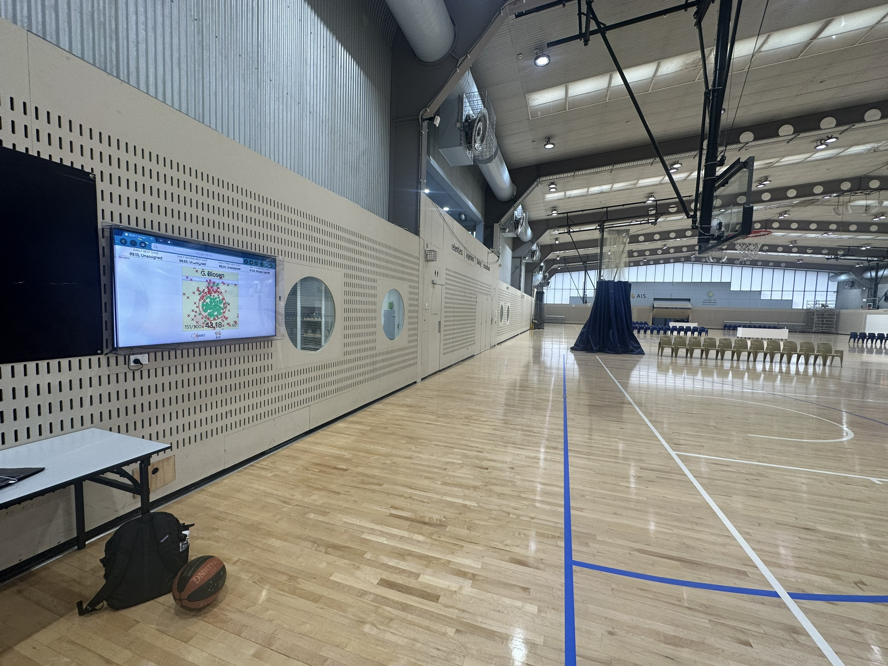
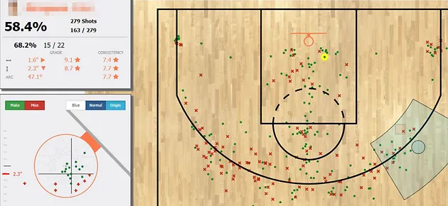

In the summer after my Sophomore year, I flew out to Canberra, Australia as an engineering research intern for the Australian Institute of Sport (AIS). The AIS engineering research department that I was working in develops technology and data analysis of athletes and their equipment to help athletes improve during training and competition.

I worked on two projects during my time at the AIS and it has since been used to aid their athletes with their training and practice.

## Creaform Hull Analysis

I worked on developing processes to analyze 3D Creaform scans for Olympic Rowing and Canoe Slalom. Creaform scanners project a coded pattern of LED lights and lasers to measure detailed surface geometries, and the goal was using scans of certain hulls to determine metrics that would be helpful to athletes and coaches.


Since each boat hull is manufactured slightly differently, we wanted to see how different the same model of hull is and how it might affect athlete performance. To do this, Geomagic Control X, which is a professional metrology software, was used to extract certain metrics: length, draft, wetted length/width, wetted surface area, prismatic coefficient, waterplane area, block coefficient, and displaced volume.

Wetted surface area would cause differences in drag in the water and symmetry would cause the boat to drift in a certain direction while moving. These metrics helped determine differences between scanned hulls to help coaches and athletes select hulls that would suit them best during practice and competition.

## RSPCT/Catapult Integration

I also created a custom software integration of a computer vision basketball shot tracking system and Catapult GNSS/GPS player location tracking. This helped athletes track their shot location and accuracy to assist with analyzing and getting insights into their performance.



RSPCT was a beta tracking system being used at the AIS, and more integrations were desired. It currently could record shooting sessions but player identification was desired to automate the data collection process.



 Players also had access to Catapult GNSS/GPS tracking devices which would record their location on all 6 basketball courts. As a result the first step was creating software to pull from the RSPCT API to gain access to individual shot location and timestamp.

 To read the two datasets, 3 helper functions for converting time, RSPCT data, and Catapult data were implemented. However, since the coordinate system for RSPCT was based on the specific court and that of catapult was for the entire gym, a coordinate converter function was needed. Key locations on each court were measured in catapult and the resulting conversion factors were used. to scale and locate the top left corner of each court. 

 ```
 # conversion values are of form ((xscale, yscale), (xshift, yshift))
 conversions = {
        1: ((1000, -1000), (25.3849292, 28.14827702)),
        2: ((-1000, 1000), (33.33403668, 3.643274151)),
        3: ((1000, -1000), (7.229115513, 22.70425535)),
        4: ((-1000, 1000), (14.75033668, -1.867725849)),
        5: ((1000, -1000), (-11.15417799, 17.07078887)),
        6: ((-1000, 1000), (-3.724727725, -7.357649041)),
    }
 ``` 

With a parsed Catapult dictionary with time keys and player name and locations as values, I only had to find the player nearest to the shot location at the given shot timestamp using a linear search algorithm.

Since the tracking used ball trajectory to plot player positions, sometimes a dunk would register incorrectly as the trajectory was being guided by the hand. After implementing lots of room for error and filtering out shots that I knew wouldn’t be tracked correctly, it was able to correctly associate shots with players through the Catapult location system and helped prove that there is value for the engineers working on the project right now to continue developing integrations between these 2 softwares for the coaches to use.