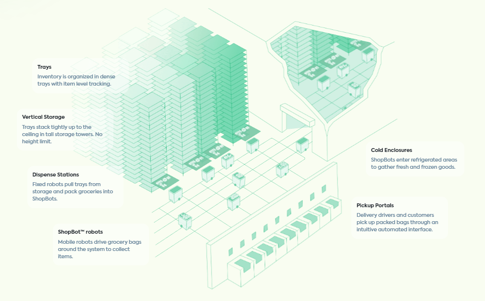
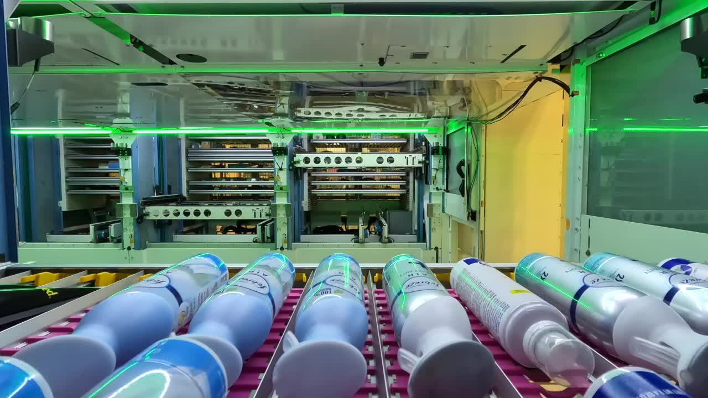

During my freshmen year summer I interned at a stealth startup in the bay area which was my first time applying my skills in a professional environment working on really cool technology! Since then, Fulfil has left stealth mode and is actively working with large grocery corporations to implement their product.

## Fulfil Solutions

Inspired by the wave of online grocery commerce during COVID, Fulfil's motive is to solve problems in he world's food supply chain through a custom warehouse automation robotic system. I worked as a systems engineer in charge of integrating various technical aspects of the product and meeting deadlines for product demonstrations for investors. Due to the fast-paced work environment of the startup, I managed multiple projects and deadlines at once under supervision and guidance of my mentor Ty Ingram MIT '18.

## Intern Projects

### Tray Detection

Helped implement a laser beam break sensors to detect when trays with items would not be fully stored correctly. Spec'ed a laser and 3D printed prototype mounts with a ball head mechanism to align the laser for each specific vertical lift system.

### Dispense Roller Design/Production

Diagnosed issues with thermoplastic conveyors breaking under repeated use in cold environments (fridge and freezer pack). Ran reliability growth testing trials to determine lifespan.

Studied the effect of ultrasonic cleaning of thermoplastic conveyors after molding to assist with adhesive mounting on the thermoplastic surface.

Developed a software filter for load cell signals on dispense arms to more accurately detect dispensing of products into the bots.

Managed technicians during major bringup processes to meet deadlines of the product for investor visits. Instructed and monitored progress of tongue production over multiple weeks.

### Product Bringup

<video width="1280" height="720" controls>
  <source src="images/video.mp4" type="video/mp4">
</video>

Assisted with all troubleshooting issues during testing and support of DoorDash beta to accurately dispense 7500+ SKUs.