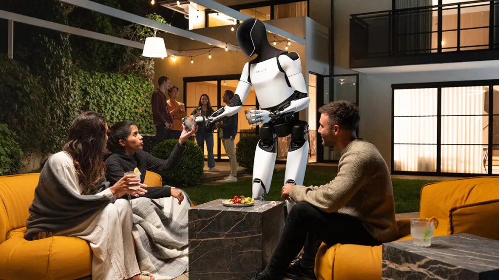

I recently had the incredible opportunity to intern at Tesla, where I worked on the Tesla Bot. The experience was both challenging and rewarding, with steep learning curves and exciting new projects to dive into every day. Collaborating with some of the brightest and most talented engineers in the industry was an absolute privilege, and I gained invaluable insights throughout the process.

It was a great chance for me to practice all of the design, manufacturing, and coding skills that I had been developing during my time at MIT. With a great mentor and supportive manager, I was able to learn more than I could have imagined. Check out some of the things I worked on at the recent "We, Robot" event!

<video width="1280" height="720" controls>
  <source src="images/dance.mp4" type="video/mp4">
</video>

The new technology that I was able to help develop was mind-blowing and I couldn't have asked for a better internship experience!

<video width="1280" height="720" controls>
  <source src="images/hand.mp4" type="video/mp4">
</video>