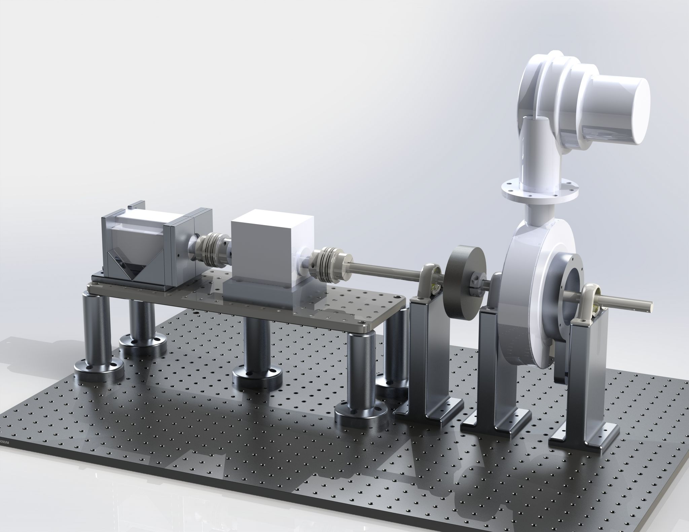

PI: MIT Prof. Kamal Youcef Toumi

Project Supervisor: PhD candidate Abhishek Patkar

### Summary

I joined the Mechatronics Lab here at MIT to help with a research project on developing control strategies for interior permanent magnet synchronous motors. To run lab tests, a custom hardware testbed that I'm responsible for is being fabricated to allow for comprehensive testing.

Prototyping was done with 3D printed parts and eventually finalized with externally sourced aluminum and steel parts. Testing of the motor was run using matlab and simulink code to develop novel control strategies leveraging concepts of neural networks and symbolic regression from machine learning.

