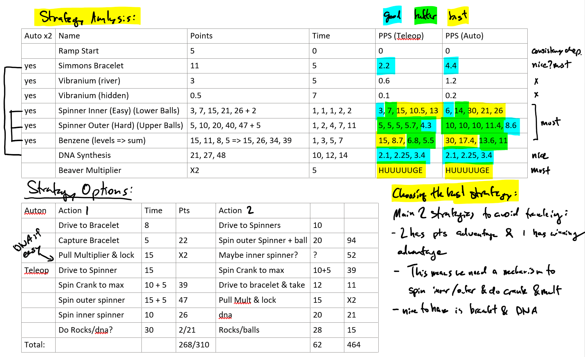
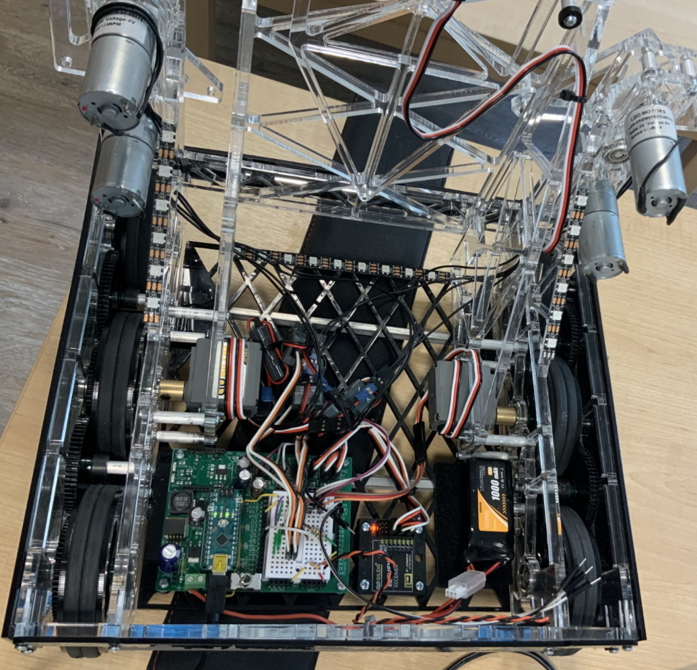

## Competition Overview

The 2.007 Design and Manufacturing course offered at MIT helps students develop their hands-on engineering capabilities through a robot competition, allowing students to showcase their robotic designs in a contest of skill and innovation.

Being the origin of the highschool FRC robotics competition, both competitions share many of the same competition roots and rules. Each robot scores points on their side of the competition field in a timed 2-minute match by using various mechanisms to navigate and manipulate objects and contraptions. Each robot has design requirements regarding power, weight, material, size, and sensor constraints ([Full 2023 rules](rules.pdf) ).

## Design Process Highlights

The full design process is documented in my [2.007 Design Notebook](007notebook.pdf).

### Strategy and Design requirements

The first step was outline a game strategy to score the most amount of points. To do so, I created a chart to analyze all the possible combinations to score points on the game field as well as a mapping of travel time estimates on the board to optimize the time on the field.

I focused on capturing the bracelet, spinning both spinners, the benzene torque spinner, and pulling the multiplier to get a total score of around 300 points.

After brainstorming various design ideas to maximize points during the game, I ended up with a design with all spinners on one side of the robot, and the dual multiplier on the other side for simplicity. 

I created a spreadsheet to calculate the motor power distribution across different mechanisms and the gearing required to do so.

[Download: Design calculation excel sheet](DBcalcs.xlsx)

### Drivebase Design

The first subsystem I began designing was the drivebase. I created high level sketches to determine the geometry of wheel placement as well as a center-drop to decrease friction while turning. I pocketed all the plates to maintain strength and decrease weight, and designed a bellypan to house the electronic components.

#### PTO (Power Take Off)

Given our motor limit on the robot, I thought it would be clever to incorporate both the winch mechanism for the multiplier as well as the drivetrain together using all 4 servos. I designed a PTO mechanism that would allow the drive wheels to slip on the floor while spinning a winch to pull the multiplier.

#### Joystick input curve mapping
On the controls side, I implemented a custom joystick curve to have better control over the inputs from the RC controller.

### Spinner Design

Over more iterations of the drivebase, I began integrating the spinner mechanisms into the drivebase frame itself to reduce partcount. The PTO and first spinner mechanism began taking shape after some assembly.

### RGB Lights

I love tinkering with rgb lights so I added indicators to tell whether the RC controller was connected, and the state the robot was in (autonomous or tele-operated).

## Final Outcome of Spinister!

While approaching the competition deadline, I realized that I had bit off more than I could chew and had to decrease my design scope due to manufacturing and time constriants. I quickly finished a full robot assembly and got on with the finishing touches and named it appropriately using the naming scheme of my highschool FRC team 254: after a decepticon, Spinister.

While I wasn't able to win the entire competition, I had an amazing time working through the semester with my lab-mates and friends. I was super stoked to be able to help and see my friend Ethan take the 1st place trophy home!