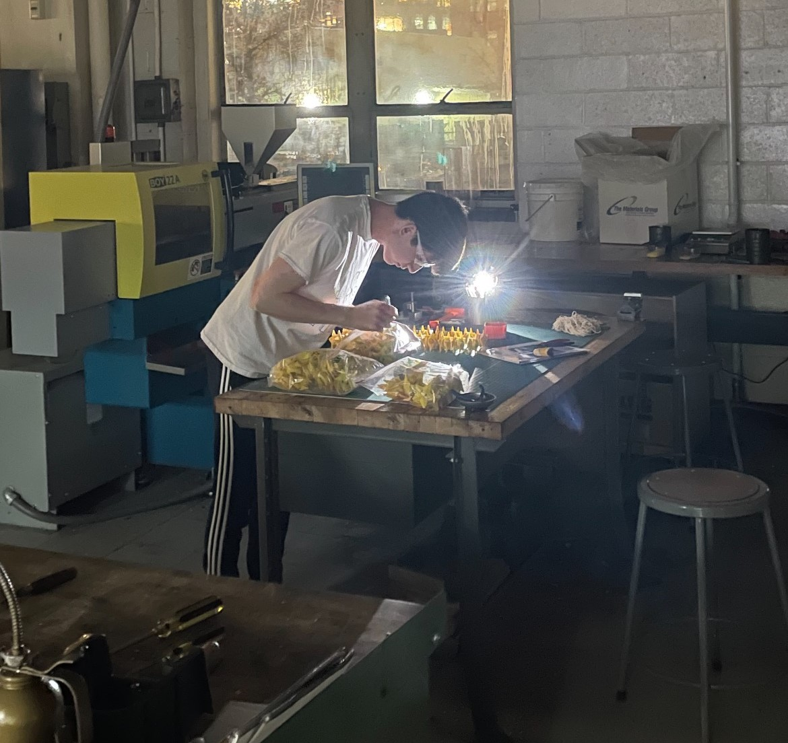

## Semester Project

Rather than having a singular final project, this design and manufacturing had us do 200 of them, but every single one being identical as the last.
We were tasked as a team to create 200 yoyos using injection molding and thermoforming processes, which would be the only way we could create that many in such a short period of time.

## Mold Making
While creating molds, we learned about draft angles, effects of part thickness on cooling uniformity, and CNC machining!

(Image of molds etc)

## Manufacturing

After testing our molds, manufacturing became the simple part of mass producing parts from the BOY injection molding machine.

## Assembly

After creating all of the parts, we started assembling them together part by part!

## Final Product

After successfully delivering our yoyos, we only had 1 yoyo fall apart during the drop test!

