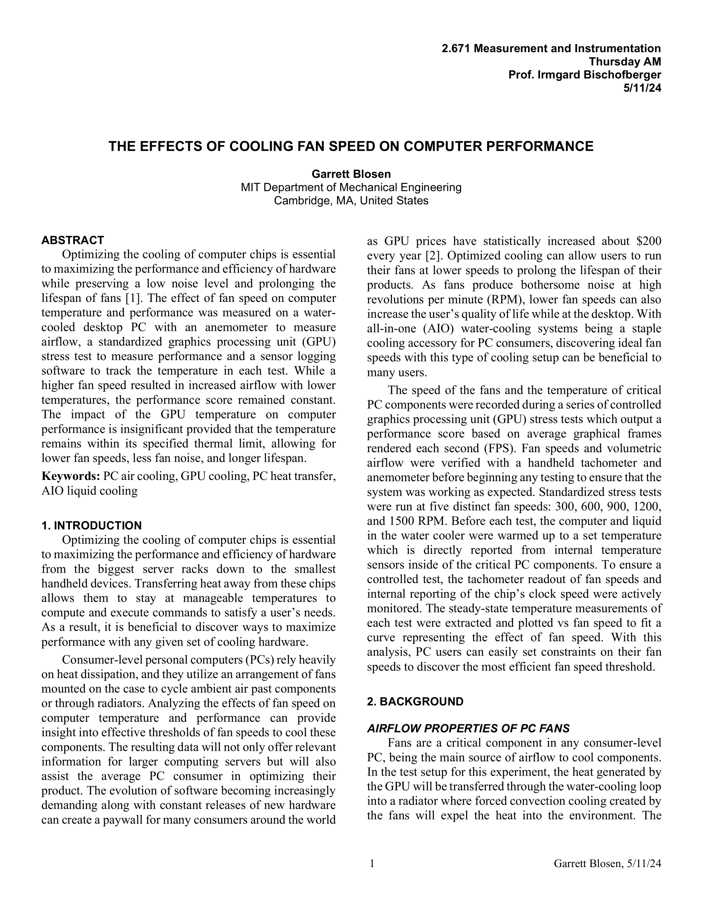
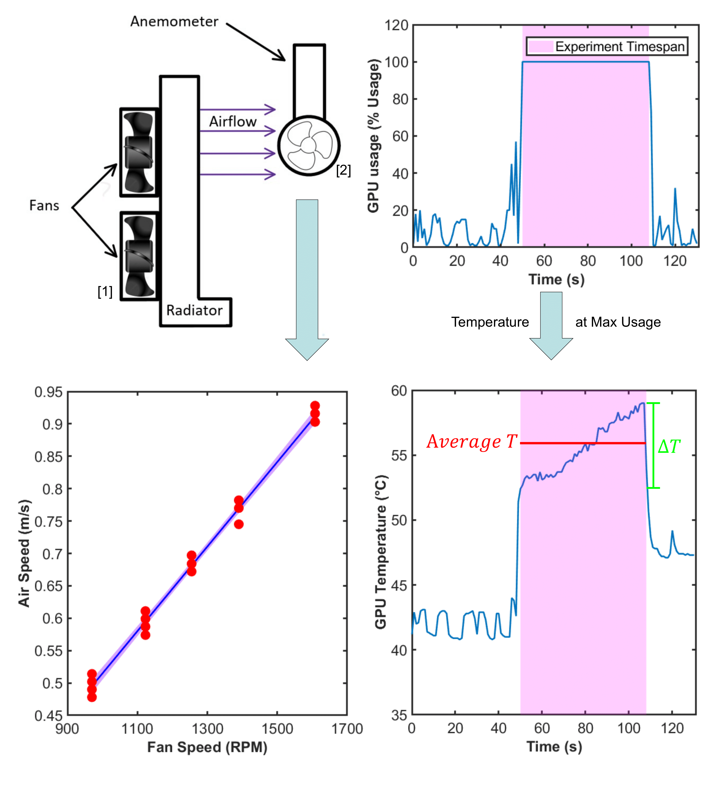
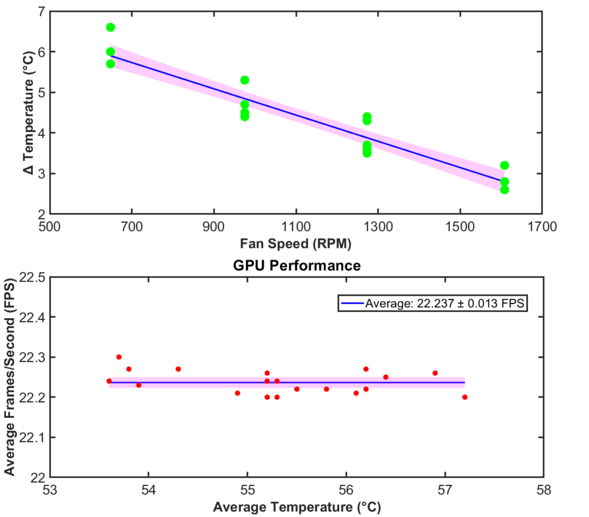

## Project Poster

## [Research Paper Write-up](paper.pdf)

## Project Description

Optimizing the cooling of computer chips is essential to maximizing the performance
and efficiency of hardware while preserving a low noise level and prolonging lifespan
of fans.

I decided to look into the result of various cooling fan speeds on the performance of the graphical processing unit, and to my surprise, I found that the temperature had insignificant effect provided the temperature remained within specified thermal limits. This would allow for lower fan speeds to help prolong fan lifespan as well as decrease ambient noise.

## Experimental Setup

I used an All-in-one watercooling setup with two 120mm fans creating forced convection cooling in a radiator, and the airflow speed was measured using an anemometer.

The Temperature and fan speed used in the statistical analysis were pulled from the 60 second test inverval where the GPU usage peaks at 100%.

## Results

After data collection, there was an observed linear decrease in temperature as the fan speed increased, however there was a constant performance across various temperatures.

## Conclusion

• Velocity of air flow linearly increased with higher fan speed at 0.0007 ± 0.0001 m/s/RPM.

• Delta Temperature linearly decreased with higher fan speed at −0.0032 ± 0.0005 ℃/RPM.

• GPU temperature had an insignificant effect on computer performance likely due to
sufficiently low temperatures that did not induce thermal throttling.

• For the range of GPU temperatures measured in this experiment, extra cooling
has no effect on performance, allowing for lower fan rpm to preserve lifespan and
decrease noise.