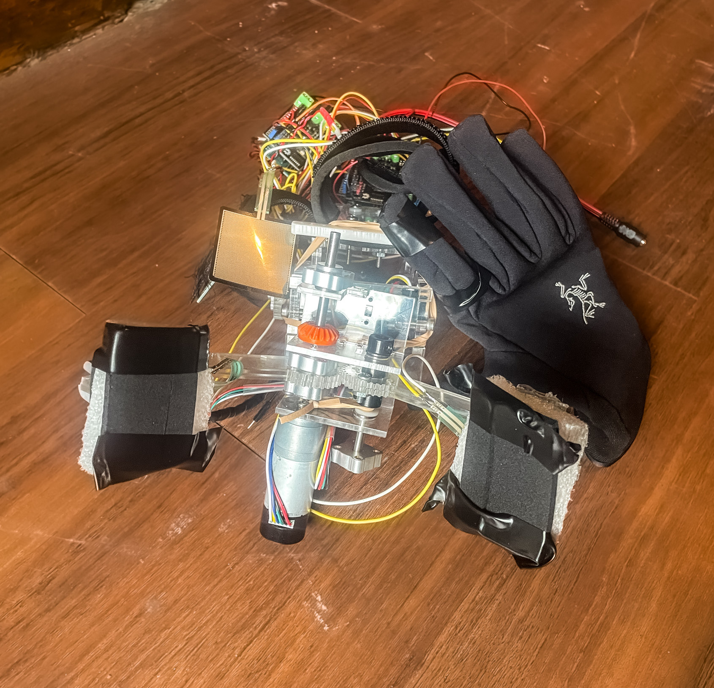
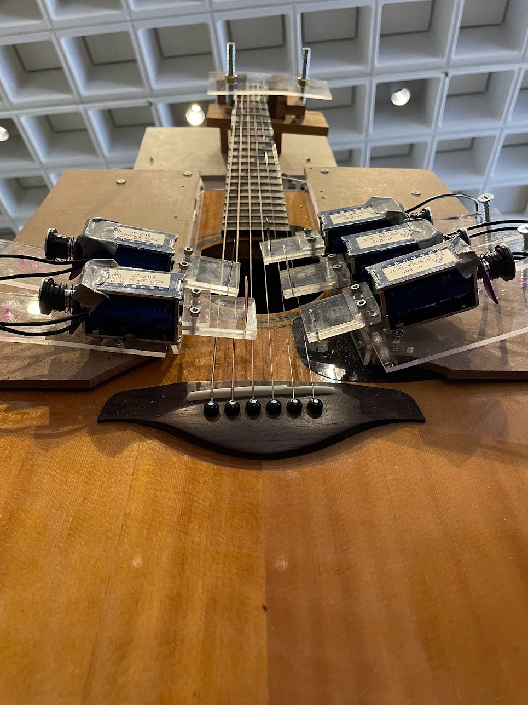

## MakeMIT 2023: Amplify
### Hand Motion Amplification Device

Award: Best Use of Sensors

Collaborators:
Aileen Liao, Andrew Woo, Ethan Chang, and Oliver Trevor

Over 3 million people suffer from carpal tunnel syndrome, a condition causing tingling and numbness in the hands and arms that impairs daily activities. Our team includes someone who experiences this and cannot perform high-torque motions with their hand. In just 24 hours, we engineered a grasping system to restore function. The interface sleeve detects hand motions and actuates a robotic claw to grab, bend, and twist objects, offloading work from the tender wrist. This assistive device is a start to granting people with carpal tunnel more mobility and independence.

<iframe width="650" height="380" src="https://www.youtube.com/embed/NJ-iOijgK1Q" title="Amplify: Motion Amplification Glove" frameborder="0" allow="accelerometer; autoplay; clipboard-write; encrypted-media; gyroscope; picture-in-picture; web-share" referrerpolicy="strict-origin-when-cross-origin" allowfullscreen></iframe>

## MakeMIT 2022: Chord-inate
### IoT-Enabled Self-Playing Guitar

Award: First Place

Collaborators:
Aileen Liao, Ethan Chang, Gregory Pylyvoch, and Oliver Trevor

The COVID-19 pandemic halted live music, so we created a solenoid-actuated IoT system to enable remote guitar playing. In just 24 hours, we developed hardware that straps onto any guitar and links it to a website. This allows individual users to access and play a guitar remotely. It also provides a way for multiple users to play music together virtually.

<iframe width="650" height="380" src="https://www.youtube.com/embed/g7ljwnxyMX4" title="Chord-inate: Demo" frameborder="0" allow="accelerometer; autoplay; clipboard-write; encrypted-media; gyroscope; picture-in-picture; web-share" referrerpolicy="strict-origin-when-cross-origin" allowfullscreen></iframe>