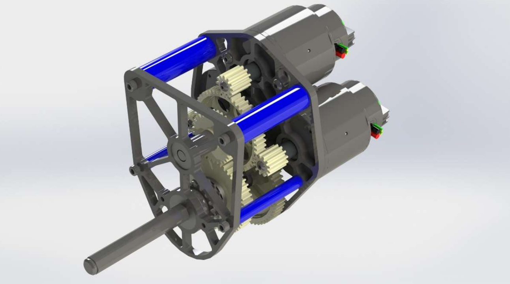
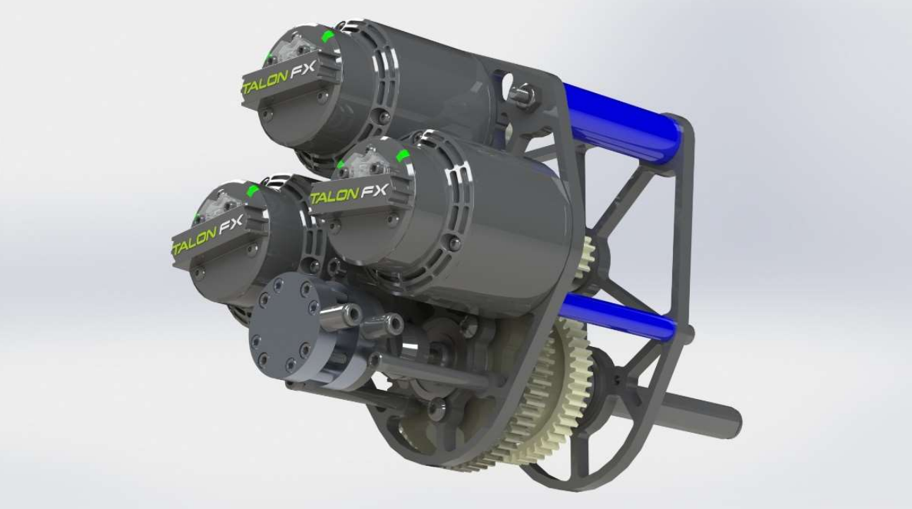
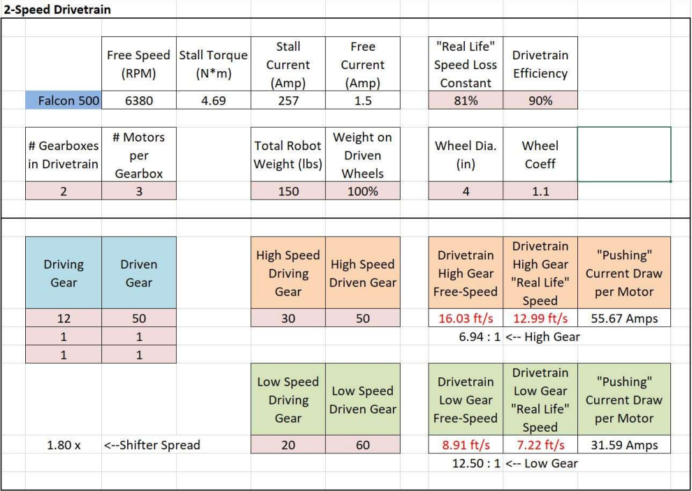
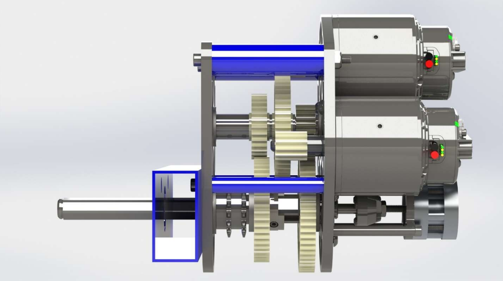
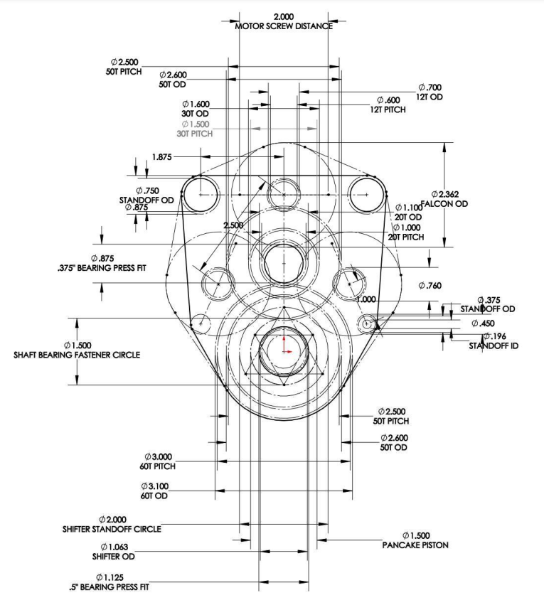
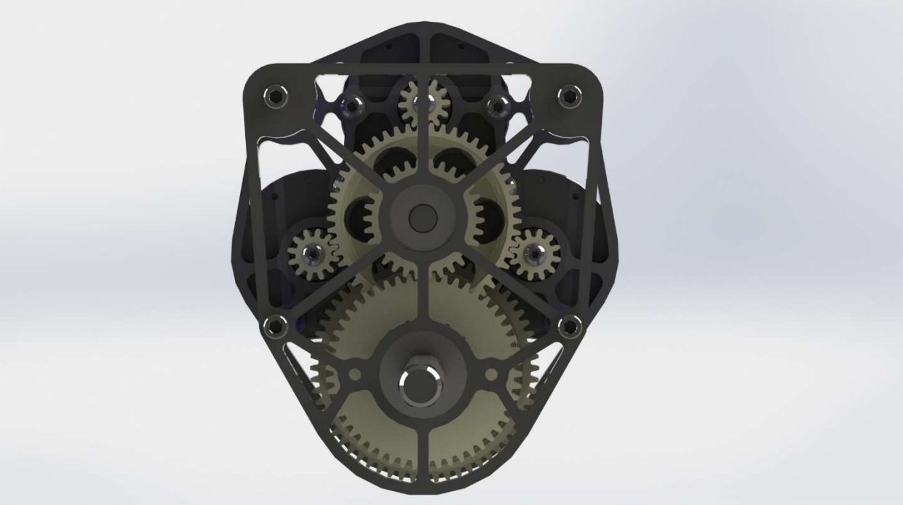

## Motivation

Drive gearboxes are key components of FRC robots, allowing the driver to traverse the field to score points during a match. However, due to gameplay aspects allowing for defense, having the highest speed robot may face issues when high torque is required to push through another defensive robot.

As a result, a shifting gearbox is desired to allow the driver to pick between a high speed drive setting to travel the field at high speeds and a torque setting to push defensive robots out of the way.

## Strategy Decisions

Back in 2019, Team 254 was a main pioneer of West-Coast Drive (a variation of tank drive with a centerdrop wheel) and it typically used two seperate gearboxes on each side of the drivetrain to power a set of wheels.

With the release of the new Falcon 500 motor, my goal was to create a gearbox that would have the power of three Falcon 500’s yet fit into a somewhat vertical form factor to accommodate other subsystems on the robot.

This gearbox allows for the drive train to drive around the field quickly and precisely while having
enough torque to push robots that are in the way. It uses a pneumatic dog shifter to switch between two
different gear reductions.

Due to form factor constraints, the actuator for the dog shifter would need to be relatively small. It would also have to have a high force output to overcome the friction keeping the dog locked in place while under load. As a result I decided to use a linear pancake piston as it had a very short height with high force output, and the short travel distance was not an issue.

## The Calculations

Calculations were made on a spreadsheet with some estimations and safety factors for motor efficiency to ensure performance on the field in the real world.

This gearbox is designed to be used on a 6-wheel drive train with 4-inch wheels. These calculations allows for the
current draw per motor to be low enough to not blow any breakers or brown out the motor. The shifter spread allows for the
driver to pick full field sprints or pushing through defense robots.

## The Layout

Looking at the gearbox stackup, we can see the pneumatic pancake piston was a good decision as it barely reaches the height of the motors, helping minimize form factor. With included mounting and tool access holes on the drivetrain 2x1 aluminum frame the gearbox can be easily mounted at any location to hold a drive wheel on the other side as well as a chain and sprocket system to drive that half of the drive train.

The third Falcon 500 motor was arranged to be on top of the other two instead on the side to
accommodate a rather vertical form factor while not taking up excessive vertical space. It also reduces the
amount of gears needed in the overall assembly and manufacturing of the gearbox. The standoffs between
the plates were separated equally to create equal support throughout the entire gearbox.

## Manufacturability of Gearbox Plates

The front gearbox plate was designed to be weight efficient yet sturdy. Using the same design for the motor mount plate could have saved ease of manufacturability and design if time were a big issue, but since the plates would be manufactured on a CNC router, spending the time to design a new reduced plate for the front side was worth it to save material used, decrease gearbox weight, and slightly smaller form factor without unused extra screw mounting holes.

## Conclusion

While the gearbox was never used on the robot due to COVID, it was still a great learning experience for me as I got to take ownership of designing a subsystem and learn the ins and outs of a design challenge.