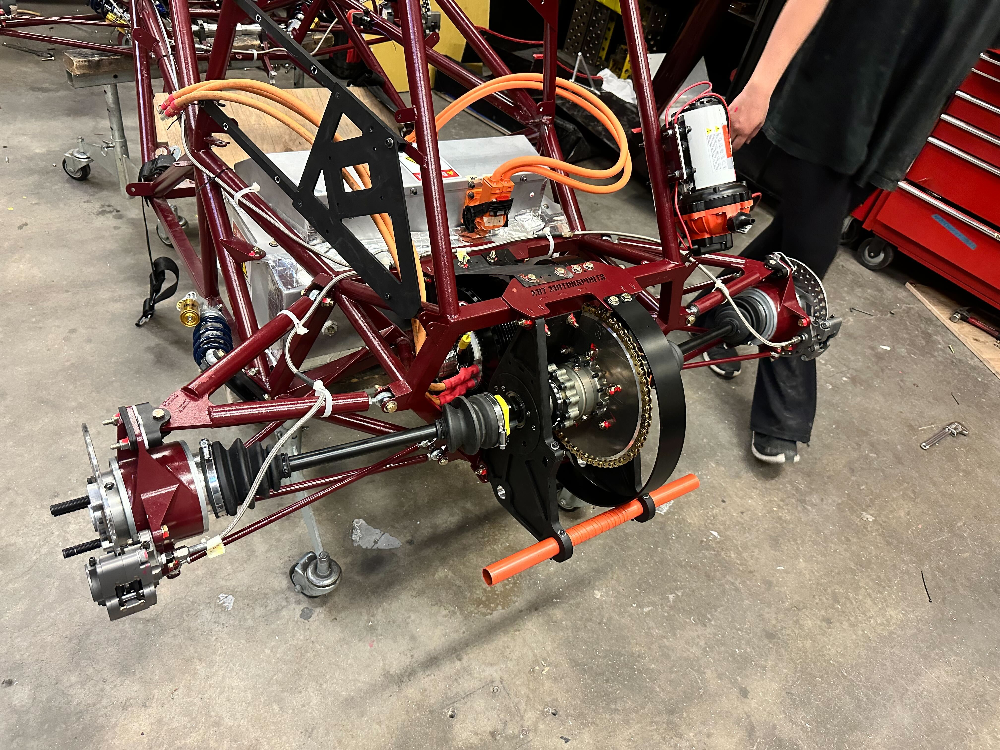
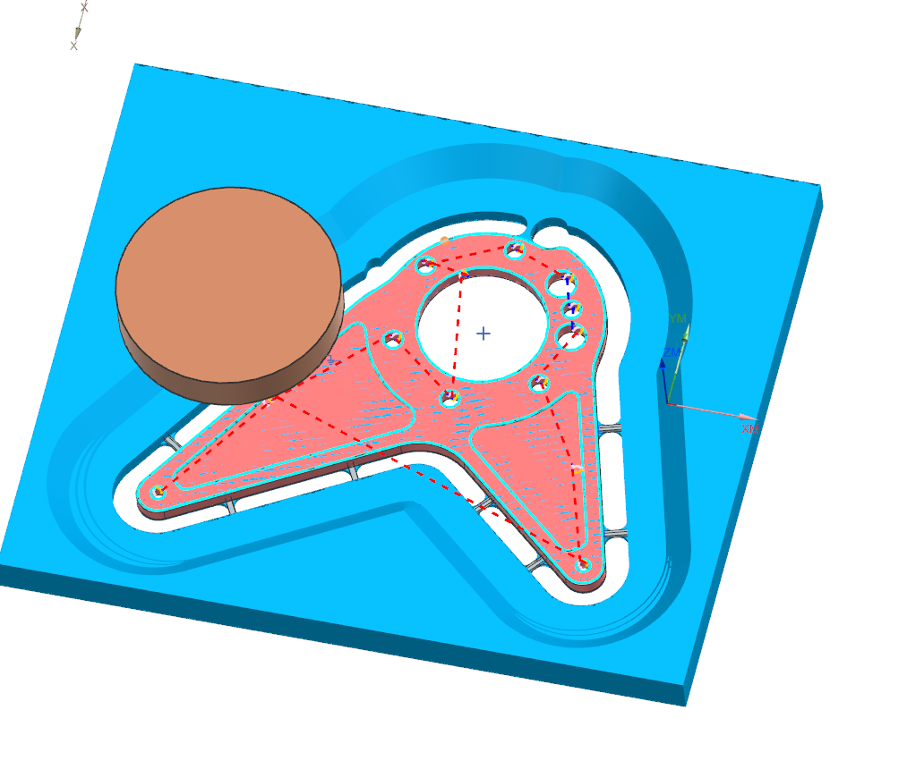
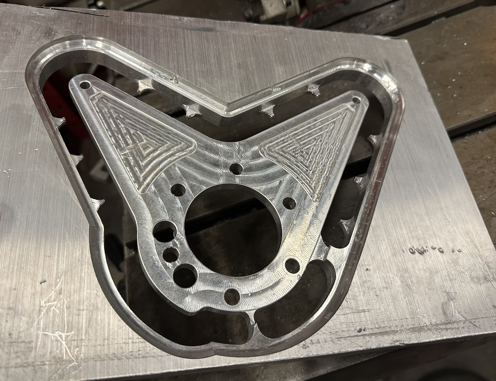

[MIT Motorsports](https://fsae.mit.edu/)

Halfway through my time at MIT, I got looped into motorsports by some friends and it turned out to be one of the best experiences during my time at school. I got to learn invaluable hands-on experience through design, prototyping, manufacturing, and testing.

## MY25 - Cooling Lead

## MY24 - Powertrain Manufacturing

I joined the MIT Motorsports team over IAP during my junior year to further pursue my passion for hands-on mechanical engineering. During that short first term on the team, I gained loads of experience and knowledge about Siemens NX, CNC manufacturing, powder coating, and much more.

The leaning curve with a new CAD and CAM software was steep but with the help of very supportive team members and friends I was able to get up and running very quickly during crunch time for powertrain manufacturing.

While I had previous academic experience in CNC CAM with [my 2.008 project](../../projects/2.008), motorsports really taught me the entire process such as prepping stock, setting up the tools in the CNC, ways to locate on a part for multiple operations, and various stock mounting methods.

