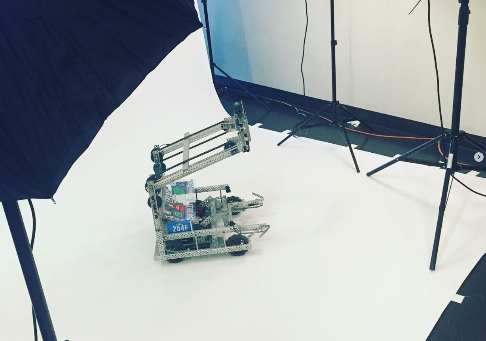
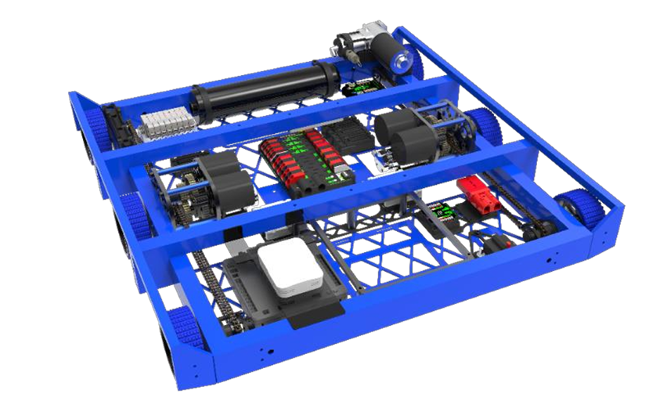
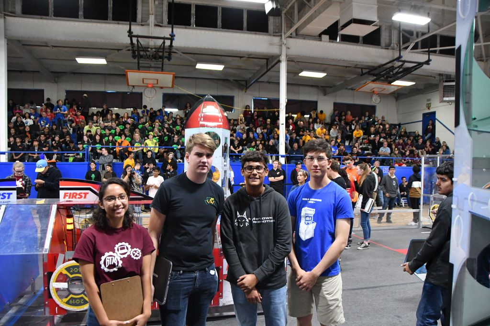

[Team 254](https://www.team254.com/)

After I attended a VEX summer camp before going into high school, I was instantly hooked on robotics. I loved the challenges of maneuvering and controlling game pieces with a robot, and it felt like the perfect progression from my love for building LEGOs. Robotics was a core high-school experience that was the spark to my passion for engineering.

## [2018 Season](https://www.team254.com/first/2018/)

### VEX

During my freshmen year, I took part in VEX robotics which gave me a fundamental hands-on experience of building and manufacturing a robot. I got to learn how to use power tools such as dremels, band saws, sanders, and drills to make our team’s top-ranking robot of the season.

### FRC

I also took part in our FRC team and got a good overview of how our team operated and got to learn a lot from the upperclassmen about more advanced machining tools such as lathes and manual mills for more precise manufacturing. Our team this year won the world championship and set the first record of never losing a single match during the season going 53-0-0.

## [2019 Season](https://www.team254.com/first/2019/)

After participating in both VEX and FRC competitions during my freshmen year, I decided to commit to FRC full-time. Being still relatively new to CAD, I worked with the drivebase of the robot, learning how to create a subsystem and design parts in tandem with other subteams in charge of other subsystems.

### Competition

This year we went with a 6-wheel drivetrain with a 1/8" center drop. It was designed to be strong and lightweight with ease of mounting our complex superstructure while maximizing space for wiring and electronics on the belly pan. We decided to power it with a 2-speed pneumatically shifting gearbox powered by 2 NEO brushless motors. Our high gear mode (7.33:1) would help push through defense robots while our high speed (11.9:1) mode would enable fast field traversal. Digital optical shaft encoders were used on drive axles as well for autonomous driving after the backlash of gearbox and chain drive.

After learning the basics of SOLIDWORKS and various manufacturing methods, I became a scouting lead and match strategist during the competition season. I loved going to other team pits during events meeting other robotics students seeing how every team had a different technical solution to the same challenge. It inspired me to strive to see every design challenge from multiple points of view to figure out what might be best.

We competed at and won two regional championships, and placed 2nd at the FRC World Championships. While it was a disappointing end to the season, I got a chance to develop and apply more of my technical skills.

### Offseason

During the offseason, I worked on making a new custom gearbox with the new Falcon 500 motors that had been released. [(Technical Blog)](../../projects/pneumatic-shifting-gearbox)

I also spent time at events competing on the pit crew and assisting the drive team, while also helping the team develop our first swerve drive robot 9254! We competed at Madtown Throwdown with our first Swerve robot which would come to be a step towards the new meta in FRC.

## [2020-2021 Seasons](https://www.team254.com/first/2020/)

After being on Team 254 for 2 years, I was elected as a Technical Lead on the team for the 2020 season, in charge of the prototyping subteam, and was chosen as our team’s driver. Unfortunately, the season was canceled due to COVID-19, but I still felt accomplished helping lead and develop a competitive FRC robot during my last year on the team.

For Technical rundowns of each robot I worked on here are the links below!

## Technical Binders

[2018 - Lockdown](https://media.team254.com/2018/07/8fda07af-2018-Techbinder.pdf)

[2019 - Backlash](https://media.team254.com/resources/Team_254_Tech_Binder_2019.pdf)

[2020-2021 - Dreadnought](https://media.team254.com/2021/07/959307c8-Team-254-Tech-Binder-2020.pdf)